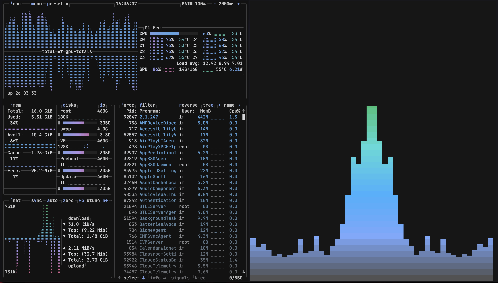
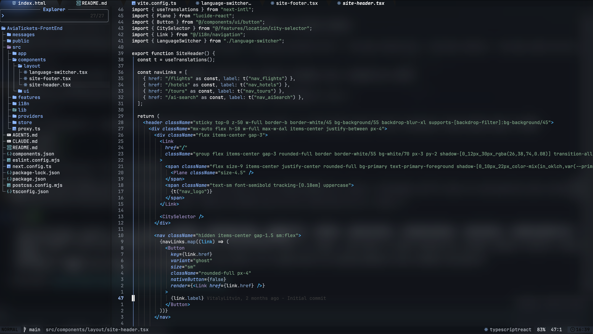
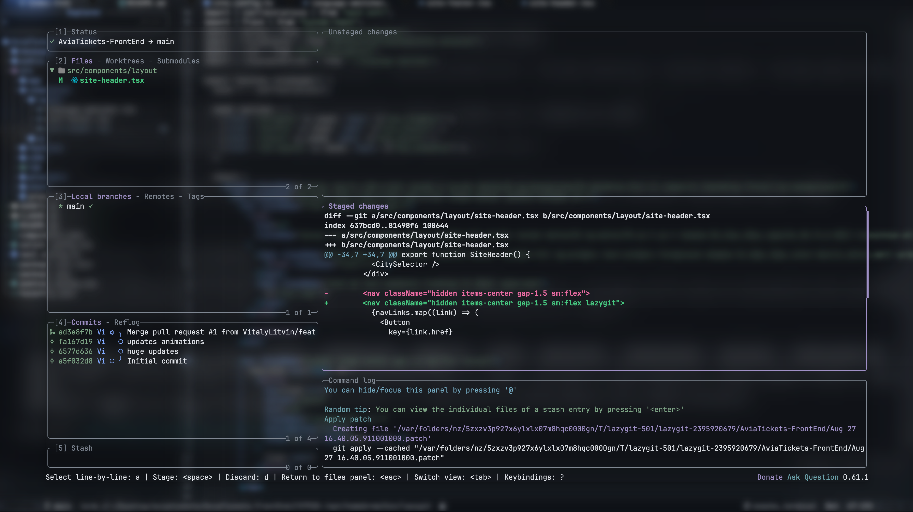

# Carbon Mist

Muted gray-blue desktop theme pack inspired by carbonfox + glassy Neovide.

## Screenshots

**btop** — system monitor with the Carbon Mist palette:

**Editor + WezTerm** — muted gray-blue syntax highlighting on a glassy terminal background:

**lazygit** — git TUI matching the same palette:

## Included
- `neovide/lazyvim/` — LazyVim + Neovide config parts
- `wezterm/wezterm.lua`
- `cava/config`
- `btop/btop.conf`
- `btop/themes/carbonfox.theme`

## Install

### 1) LazyVim / Neovide
Copy files into your `~/.config/nvim/lua/`:
- `config/options.lua`
- `config/keymaps.lua`
- `plugins/ide.lua`
- `plugins/ui.lua`

### 2) WezTerm
Copy `wezterm/wezterm.lua` to:
- `~/.config/wezterm/wezterm.lua`

### 3) CAVA
Copy `cava/config` to:
- `~/.config/cava/config`

### 4) btop
Copy files:
- `btop/btop.conf` -> `~/.config/btop/btop.conf`
- `btop/themes/carbonfox.theme` -> `~/.config/btop/themes/carbonfox.theme`

## Notes
- Neovide currently uses strong glass settings (`opacity=0.10`, blur enabled).
- Theme name: **Carbon Mist**.
